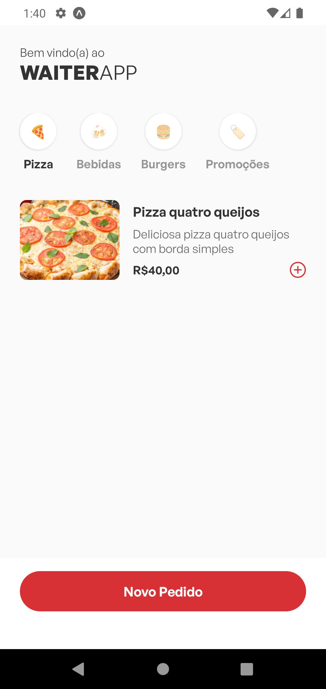
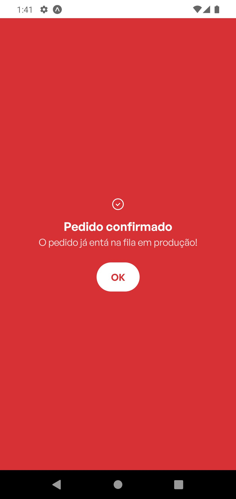
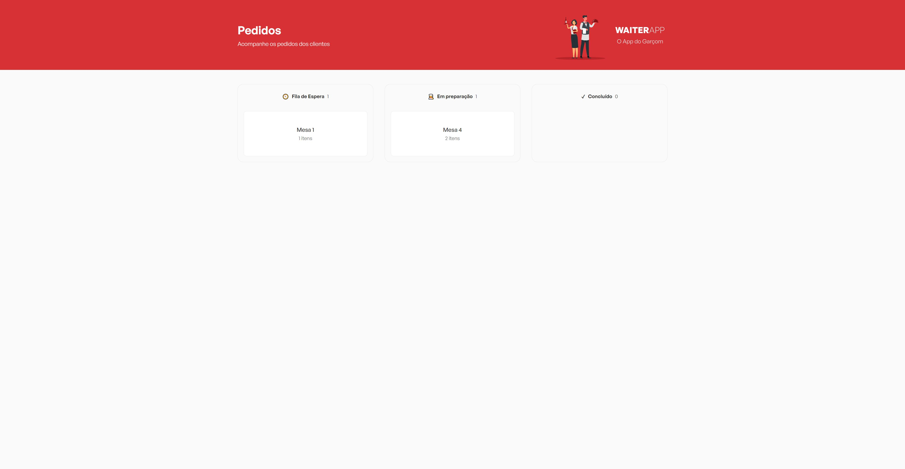

# Waiters App

Waiters App é um aplicativo de gerenciamento de pedidos, desenvolvido durante a semana: **O Poder do Javascript**, ministrado pelo instrutor Mateus Silva.


 


---

## 🚀 O Aplicativo

Waiters App é um aplicativo desenvolvido para que restaurantes e barres gerenciem os pedidos feitos pelos clientes, através de um sistema mobile (android e ios) os clientes conseguem realizar pedidos, que serão gerenciados através de uma dashboard em um sistema web.

<table>
  <tr>
    <td></td>
    <td></td>
    <td></td>
  </tr>
  <tr>
    <td></td>
    <td></td>
    <td></td>
  </tr>
</table>

<table>
  <tr>
    <td></td>
  </tr>
</table>


## ⚙️ Instalação

### 📋 Pré-requisitos

Para utilizar o aplicativo será necessário ter instalado o banco de dados **mongodb** ou caso prefira uma instância do Docker com o mesmo, caso opte pelo docker você pode executar esses comandos para fazer sua instalação:

Baixar a imagem do mongo:
```
docker pull mongo
```

Criar uma instância do mongo db no docker:
```
docker run --name mongodb -p 27017:27017 -d mongo
```

Após a instalação inciar o container.

<br/>

---

<p style="color:#f44336">
  <strong>Importante:</strong> Caso você crie o container com um nome diferente do das instruções, você deverá editar: `api > src > index.ts` (linha 13) a conexão com o banco.
</p>

---

<br/>

### 🔧 Como utilizar

Faça um clone da aplicação:

```
https://github.com/gustavosorati/o-poder-do-js-waiters-app.git
```

Instale as dependências das pastas: **api, frontend, mobile**:

```
npm i
```

Execute o scripts para rodar os projetos:

```
npm run start
```

Se tudo ocorrer certo o projeto estará rodando, contudo não terá dados, através das rotas `/products` e `/categories`, você poderá alimentar o sistema.

<br/>


## 👀 Comando uteis

1. Listar os dispositivos android's ativos

```
adb devices
```

2. Mudar o endereço de IP para que o android reconheça o localhost

```
adb -s emulator-5556 reverse tcp:5000 tcp:5000
```

3. Matar e iniciar o adb

```
adb kill-server
adb start-server
```

## 🎁 Agradecimentos

Foi uma semana muito intensa e puxada, o tempo total de hora aulas passaram de 15:00 horas, foi muito aprendizado nessa aplicação, então sou grato por todo conteúdo adquirido.

---

Feito com ❤️ por [Gustavo Sorati](https://github.com/gustavosorati) 

